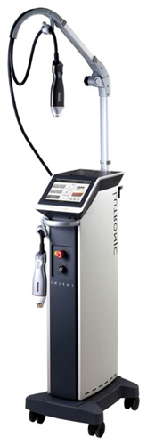

Глубокий 3D лифтинг на аппарате INFINI
--------------------------------------

{.width-25 .float-right}

__3D-лифтинг__ - это процедура, которая обладает положительными
качествами как фракционного, так и радиочастотного омоложения. Аппарат
Infini (США) проникает в глубокие слои кожи, не нарушая целостность
наружного слоя кожи. Действует на различных ее уровнях, способствуя
восстановлению, а также стимулирует процессы выработки коллагена.

Сразу после процедуры отмечается хороший эффект, который можно сравнить
только с результатом после лазерного омоложения, но с минимальным
рисками и легкой реабилитацией.

Кому показан 3D-лифтинг по методике Infini?
-------------------------------------------

++Показаниями к процедуре являются:++
* дряблая кожа
* морщины
* стрии и растяжки
* расширенные поры, постакне
* неровная структура кожи, улучшение ее цвета,
* обвисшая кожа вследствие резкой потери веса, а также после
  беременности.
* Как профилактическое мероприятие фотостарения, хроностарения кожи.

Преимущества методики:
----------------------

* Радикальный эффект без риска появления ожогов, рубцовых изменений и
  пигментации.
* Омоложение без операционного вмешательства.
* Короткий, безболезненный реабилитационный период.
* Минимальный период восстановления.

Как это работает?
-----------------

Процедура имеет два последовательных этапа:

1. Лечебный прокол -- на насадке аппарата есть 16 (или 49) микроигл с
   специальным золотым напылением. Иглы проникают в кожу на глубину 3,5
   милиметра (это в три раза больше, чем при фракционном омоложении),
   создавая отверстия в коже, через которые поступает энергия на втором
   этапе.

2. радиочастотный термолиз -- на кончике иглы образуется два канала
   подачи радиоизлучения: один воздействует теплом и проникает только в
   поверхностные слои кожи, а второй -- в глубокие (таким образом
   обеспечивается лифтинг-эффект, выравнивается рельеф кожи). При
   проколе импульсы действуют на коллагеновые волокна как раздражитель,
   заставляя их сокращаться. При этом происходит мощная стимуляция
   клеток кожи --фибробластов и запускается синтез нового коллагена.

При этом к коже отправляются сигналы о запуске механизмов
восстановления, происходит активация факторов роста. Повреждения
эпидермиса практически не происходит, заживление проколов совершается в
течении нескольких минут.

Исследователи отмечают, что при аналогичном лазерном воздействии
обязательно образовались бы термические ожоги. Так как аппарат в
аппарате Infini тепловое воздействие окружает именно кончик иглы,
эпидермис не затрагивается, следовательно, побочные эффекты в виде
ожогов и пятен отсутствуют.

Каковы преимущества Infini?
---------------------------

* Высокая эффективность методики в совокупности с минимальной
  травматичностью кожного покрова.
* Процедура обеспечивает впечатляющий эффект омоложения, при минимальных
  рисках и коротком реабилитационном периоде.
* Восстанавливается здоровый цвет лица кожи вследствие улучшения питания
  кожи. В результате многочисленных микропроколов увеличивается
  количество каналов в межклеточном веществе, поэтому ценные питательные
  вещества доставляются к клеткам быстрее. Это приводит к нормализации
  обмена веществ в коже.
* Безопасные иглы. Микроиглы аппарата Infini покрыты специальным тонким
  золотым покрытием, поэтому не приводят к возникновению раздражения в
  коже. Основание микроиглы изолировано силиконом, который защищает
  эпидермис от теплового воздействия. При процедурах используют только
  одноразовые стерильные насадки.
* Индивидуальная настройка аппарата. Благодаря наличию множественных
  опций, врач индивидуально подбирает глубину проникновения, а также
  длительность и интенсивность действия аппарата Infini. Благодаря
  изолированности каждой иглы, они могут использоваться как в одиночном
  порядке, так и одновременно.
* 3D-лифтинг -- является передовой инновационной методикой, которая
  впервые была представлена в 2012 году. За время тестирования она
  показала высокий результат, достойный уважения, а также исключительно
  положительные отклики от пациентов.
* Во всем мире проведено более десяти тысяч процедур, а также
  клинические исследования, которые подтверждают эффективность и
  множественные достоинства технологии Infini.

Как проходит процедура?
-----------------------

В среднем процедура проводится в течении одного-двух часов. За этот
сеанс выполняется примерно двести тысяч микропроколов. Сначала кожа
обрабатывается специальным кремом, который содержит анестетик (для
чувствительного типа кожи). После этого врач настраивает аппарат,
выбирает необходимую глубину прокола, а также время и интенсивность
действия. После этого всего за одну десятую секунды иглы проникает в
кожу, происходит радиочастотный термолиз и иглы также быстро
извлекаются.

Сколько процедур мне потребуется?
---------------------------------

Для получения максимально эффектного результата необходимо пройти полный
курс комплексного омоложения лица, который составляет две-три процедуры.

Сама процедура является практически безболезненной, так как иглы вводят
очень быстро, а кончик иглы с золотым напылением не раздражает болевые
рецепторы, так как проникает глубже их расположения. При высокой болевой
чувствительности для обезболивания рекомендуется использование крема с
анестетиком. Также врачи в своей практике используют порядное введение
иголочек, чтобы максимально уменьшить неприятные ощущения.

Как я буду выглядеть после процедуры?
-------------------------------------

После процедуры 3D-лифтинга наблюдается короткий период реабилитации,
сроком три-четыре дня. При этом может отмечаться красота и легкие отеки.
Врач индивидуально подбирает средства по уходу за кожей лица, поэтому
она быстро и без проблем восстанавливается, достигается максимальный
эффект, который длится в течении двух лет.

***Эффекты:***
* Омоложение и подтяжка кожи.
* Подтянутая кожа вокруг век, которая обеспечивает <<сияющий взгляд>>.
* Ровный рельеф кожи, здоровый цвет лица.
* Уменьшение расширенных пор.
* Здоровая и подтянутая кожа на теле.
