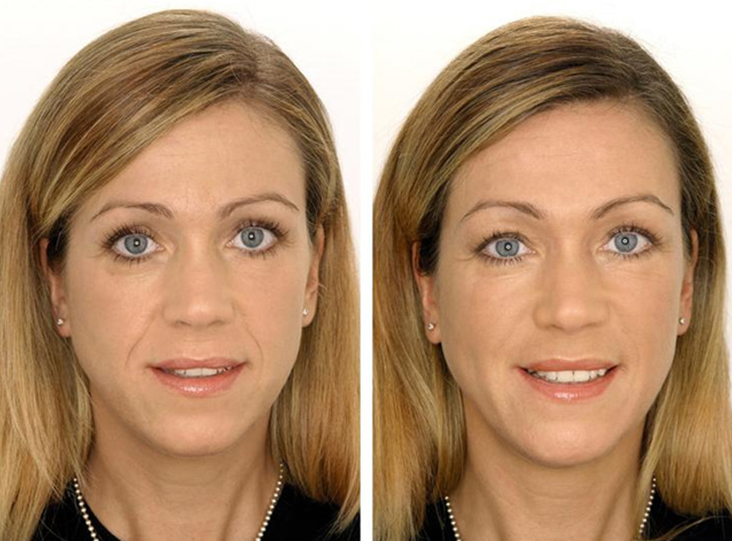

Если Вы хотите оставаться неотразимой и радовать окружающих своей
красотой, наш косметический кабинет предлагает Вам пройти курс
омоложения с использованием инновационной технологии светового
воздействия по доступной цене.

Фотоомоложение -- это метод аппаратной косметологии, который позволяет
стимулировать выработку коллагена и усилить регенерацию клеток кожи.
Косметологический аппарат, установленный в нашем салоне красоты,
обладает высокой эффективностью благодаря одновременному использованию
мягкого светового излучения и биполярного радиочастотного тока.

## Фотоомоложение лица

Основной задачей этой процедуры является повышение упругости и
эластичности кожи, ускорение обменных процессов в клетках кожи и ее
обновление. При фотоомоложении лица происходит воздействие света с
определенной длиной волны на волокна коллагена кожи. Это активирует их и
стимулирует выработку нового коллагена. Интенсивное воздействие света
усиливает кровоток, раскрывает капилляры и коллатерали, благодаря чему
клетки кожи получают больше питательных веществ. Одновременное
воздействие биполярного радиочастотного тока усиливает процессы
регенерации в глубоких слоях кожи, что приводит к улучшению ее
структуры.

{.width-50 .float-right}

Если говорить о финансовой стороне вопроса, то на фотоомоложение цены
примерно соответствуют другим аппаратным косметологическим процедурам.
При этом метод омоложения кожи с помощью световых волн не вызывает
дискомфорта и неприятных ощущений, он безопасен и не требует соблюдения
какого-либо реабилитационного периода.

Уже после третьей процедуры Вы заметите эффект омоложения и легкий
эффект лифтинга. Но самое удивительное, что действие аппарата не
прекращается даже после окончания самой процедуры. Выработка волокон
коллагена продолжается даже спустя несколько месяцев, а значит, Ваша
кожа будет становиться все более упругой, здоровой и молодой с каждым
днем.

