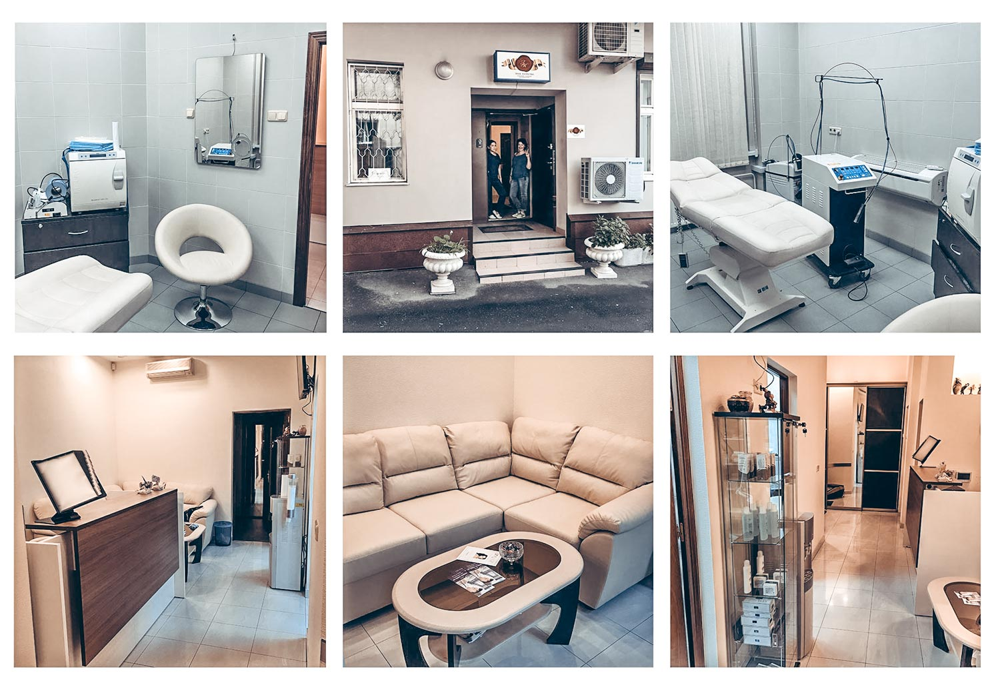

Медицинский центр <<Знак качества>> - команда молодых, энергичных и
увлеченных своим делом специалистов-профессионалов в области лазерной и
инъекционной косметологии.

Центр открыт в 2013 году, однако в кратчайшие сроки завоевал заслуженную
популярность, благодаря использованию новейшего оборудования, высокому
профессионализму врачей и доступным ценам.

Центр находится в самом центре Москвы -- Рыбников переулок, дом 4.

Специализация центра -- anti-aging терапия, лазерная эпиляция
александритовым лазером, лазерное удаление сосудов и сосудистых
звездочек на лице и на теле, контурная пластика, нитевой и
плазмолифтинг, пилинги и уходы за кожей лица и тела.

Инновационные методики омоложения в медицинском центре - это:
* Лазерная эпиляция на новейшем оборудовании ведущих европейских и
  американских производителей;
* Преимущества фракционного СО2 омоложения
* Инъекции красоты -- модная и эффективная процедура
* Плазмолифтинг
* Биоревитализация
* Контурная пластика -- современный метод борьбы с морщинами
* Нитевой лифтинг APTOS
* Удаление татуировок, сосудов
* Мезотерапия: молодость и свежесть

Медицинский центр <<Знак качества>> предлагает консультацию врача и
индивидуальный комплексный подход к каждому пациенту, что выражается в
индивидуальном подборе и использовании комплекса процедур и препаратов,
нацеленных на решение конкретной проблемы. Наши врачи, устраняя
имеющиеся у пациента проблемы, используют наиболее щадящие,
безболезненные и эффективные методики, а также стремятся задействовать
превентивные меры для устранения проблем, возникающих в будущем.

Вместе с демократичными ценами, акциями и скидками постоянным клиентам
наш медицинский центр обеспечивает индивидуальный подход к каждому
клиенту.

Эффективность работы медицинского центра <<Знак качества>> определяется
нацеленностью на результат, что в свою очередь достигается тремя
основополагающими принципами работы центра:
* подход к пациенту и его проблемам, предполагающий индивидуальное и
  комплексное использование доказавших свою эффективность методик;
* жесткие требования к используемому оборудованию и препаратам;
* высокая квалификация врачей.

Наилучший результат обеспечивается комплексным подходом к решению
конкретной проблемы. Так, использование ботулинотерапии не обеспечивает
молодость, ухоженный вид и резкий anti-aging эффект, однако вместе с
другими аппаратными и инъекционными методиками обеспечивает решение
многих проблем.

Главный врач клиники -- врач-дерматолог с мировым именем Алла
Александровна Легун.
