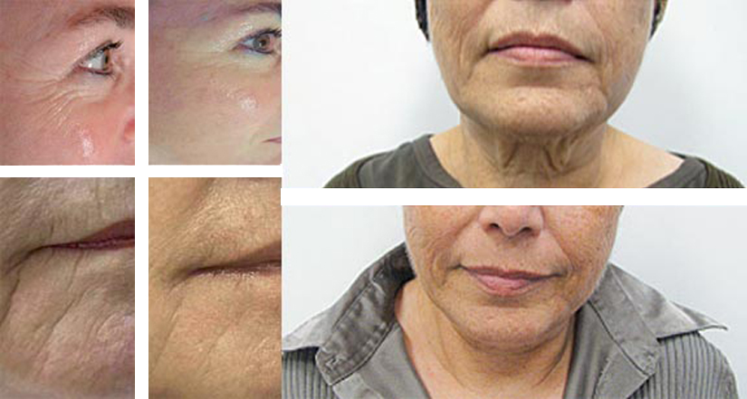

Клиника красоты «Знак качества» гарантирует омоложение кожи благодаря
использованию СО2 лазера с применением высокоточного сканера.
Оборудование прошло многочисленные лабораторные исследования,
подтвердившие безопасность для кожи. Квалифицированные специалисты
готовы устранить практически все кожные патологии за очень редким
исключением.

Аппарату SmartXide2 DOT/RF присвоен статус уникального. В нем
предоставлена возможность устанавливать параметры, соответствующие
каждому конкретному случаю (всего 30 млн. настроек).

Современное оборудование позволяет избавляться без оперативного
вмешательства от рубцов:

* гипертрофических
* келлоидных
* атрофических

Фракционная лазерная шлифовка – эффективный способ борьбы с растяжками.
После удаления новообразований исключены негативные последствия, щадящее
воздействие оборудования не травмирует кожу.

Для избавления от рубцов, являющихся последствиями угревой сыпи,
достаточно посетить косметологический кабинет 3-5 раз, в зависимости от
индивидуальных особенностей кожи пациентки. Сеанс лазерного пилинга
доступен и эффективен. До проведения процедур многие клиентки не
представляли жизнь без макияжа, наша клиника красоты предоставляет
возможность начать жизнь с чистого листа, навсегда забыть о комплексах.

Если вы приняли решение омолодить веки, обращайтесь в «Знак качества»,
профессионализм специалистов и современное оборудование – гарантия
безупречного результата. Лазерная шлифовка век выпаривает излишки кожных
образований, параллельно стимулирует процессы выработки эластина и
коллагена.

Консультации квалифицированных специалистов позволят избавиться от
сомнений относительно возможности осуществления той или иной процедуры.
В клинике регулярно осуществляют подтяжку и лазерное омоложение
проблемных зон:

* внутренняя часть беда
* декольте
* шея
* плечи
* кисти рук

Гиперпигментация и удаление веснушек – одна из самых востребованных и
простых процедур, результат которой является лучшей рекламой новейшего
оборудования. Независимо от уровня сложности процедуры, доктора
прилагают максимум усилий для того, чтобы путь к совершенству не
сопровождался болезненными ощущениями. К примеру, процедуре «фраксель»
предшествует нанесение специального обезболивающего геля. В нашей
клинике красота доступна без жертв.

В среднем процедура устранения дефектов кожи длится 1,5-2 часа. После
окончания сеанса участок, на который осуществлялось воздействие лазером,
остается абсолютно чистым и сухим. Бесспорным преимуществом лазера,
сравнительно с оборудованием аналогичного предназначения, является
отсутствие выделений (сукровицы), которые являются благоприятной средой
для размножения микроорганизмов.

Период реабилитации после осуществления фракционного термолиза зависит
от особенностей организма пациентки, в среднем длится 3-5 дней.
Определить возраст клиенток, прошедших серию сеансов, невозможно.
Женщинам предоставлена возможность продлить молодость на неограниченный
срок. Для сокращения реабилитационного срока неукоснительно следуйте
рекомендациям доктора. Назначенные препараты стимулируют
восстановительную функцию организма, заживление протекает безболезненно.
Отечность исчезает в течение 1-2 дней, для избавления от корочек
необходимо примерно 4 дня. Получить истинное наслаждение от собственного
отражения в зеркале вы сможете на пятый день после осуществления
процедуры. Натуральная красота вашей кожи не может остаться
незамеченной.

Для усиления эффекта процедуры рекомендуется через 5-7 дней после
проведения сеанса пройти биоревитализацию посредством гиалуроновой
кислоты. Потратив минимум времени, вы запустите механизм омоложения,
который будет продолжаться в течение 3-4 месяцев. При этом от вас не
потребуется дополнительных вложений, только привычный повседневный уход.

Распространено заблуждение относительно того, что в весенне-летний
период следует воздерживаться от фракционного лазерного термолиза.
Специалисты клиники успешно осуществляют процедуры в любое время года.
Для исключения нежелательного воздействия ультрафиолетовых лучей в
течение реабилитационного периода назначают специальные защитные кремы и
спреи. Стремление к совершенству и соблюдение рекомендаций специалистов
предоставит вам возможность выглядеть идеально! Богатый практический
опыт докторов позволяет с легкостью подбирать индивидуальные программы
омоложения, назначать комплекс реабилитационных процедур, направленных
на скорейшее восстановление.

Приоритетом клиники является здоровье пациенток, каждый случай
рассматривается в индивидуальном порядке.

Фракционное лазерное омоложение гарантирует следующие результаты:

* подтяжку кожи различных участков тела
* улучшение цвета и структуры кожи
* безопасное омоложение век
* 100% избавление от пигментации
* устранение возрастных изменений кожи рук
* подтяжку ягодиц без оперативного вмешательства
* лифтинг декольте и шеи
* удаление растяжек

Не доверяйте специалистам с сомнительной репутацией, низкая цена и
использование современного оборудования – несовместимые понятия.
Доверьте уход за вашей внешностью профессионалам.

