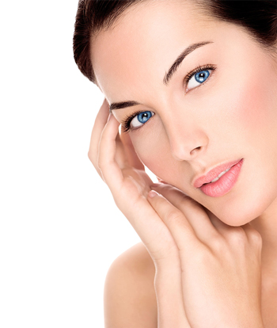

К сожалению, после 30 лет морщины, которых раньше мы не замечали,
становятся более глубокими и переходят в категорию <<линии жизни>>. И
тогда приходит момент, когда средства косметики не могут справиться в
борьбе с возрастными изменениями кожи. В помощь нам приходит фракционное
лазерное омоложение.

В последнее время фракционное лазерное омоложение стало очень популярным
не только в США и странах Европы, но и у нас в России. Этот чудесный
метод помогает одновременно бороться с разными проблемами внешности. В
процессе, такие дефекты кожи, как рубцы, стрии и пигментация, исчезают.
В результате процедуры, мы получаем сильный омолаживающий эффект.
Пациент в итоге выглядит очень красивым и молодым.

Сама суть этой процедуры состоит в том, что устранение эпидермиса
проходит <<фракционно>>. То есть равномерными участками, а не на всей
поверхности кожи сразу. Благодаря такому методу, заживление кожи
происходит довольно быстро и без каких-либо негативных последствий.
Значительные улучшения видно сразу же после первой процедуры. Повышается
эластичность и кожа становится более упругой. Специалистом производится
поверхностная анестезия, благодаря которой человек чувствует только
небольшое покалывание в области, которая обрабатывается. После
завершения процедуры, специалист наносит на кожу специальный крем и
проводит с пациентом консультацию по ухаживанию за кожей в дальнейшем.
Но важно знать то, что дополнительный уход не потребуется в течение
нескольких дней. В первые три - четыре дня кожа лица постепенно будет
отекать, потом немного покраснеет. На пятый - седьмой день, умершие
клеточки отойдут, сама кожа начнет шелушиться, освобождая место для
новой и молодой кожи, которая станет красивой и здоровой.

## Опасно ли фракционное лазерное омоложение?

Фракционное лазерное омоложение является абсолютно безопасной
процедурой. В нашей клинике <<Знак Качества>> процедура проводится с
помощью лазера SmartXide DOT CO2. Огромным плюсом этого лазера является
то, что возрастных ограничений он не имеет. Его используют для любых
проблемных участков кожи. После его использования защитные функции кожи
сохраняются и нет риска попадания каких-либо инфекций.

Процесс фракционного лазерного омоложения имеет достаточно показаний,
когда он покажет свой волшебный омолаживающий эффект. Морщины, поры,
которые были расширены, пигментация кожи лица, появление рубцов и
растяжек, акне и сосудистых звездочек, отвисшая и дряблая кожа. Если у
вас появилась хоть одна из этих проблем, тогда вам обязательно следует
сделать фракционное лазерное омоложение. Это процедура решит все ваши
проблемы с кожей.

Также стоит знать ряд противопоказаний данной процедуры. Следует
отказаться от воздействия лазера на кожу, если у вас: псориаз,
эпилепсия, аллергия, инфекции кожи. Обязательно учитывайте это.

## Преимущества фракционного лазерного омоложения

Процедура фракционного лазерного омоложения имеет ряд существенных
преимуществ по сравнению с другими методами омоложения:
* изменения заметны уже после первого сеанса;
* безболезненность;
* небольшой реабилитационный период;
* подходит для всех типов кожи;
* возможность сделать процедуру в очень деликатных областях: зона шеи,
  век, декольте, кисти рук;
* индивидуальный подход для каждого клиента.

Фракционное лазерное омоложение быстро и безболезненно подарит вашей
коже радость, молодость и здоровье. В результате этой чудесной процедуры
вы действительно получите желаемый эффект и его результатом будут:
* избавление от растяжек и рубцов на коже;
* сужение пор;
* разглаживание морщин;
* отбеливание кожи лица и улучшение его цвета;
* контуры лица станут более четкими;
* дряблая кожа заметно подтянется, приобретет эластичность и станет
  более упругой.

Результат вы увидите уже через 8-9 дней после проведения первой
процедуры. Для окончательного закрепления эффекта, нужно провести
несколько процедур, о регулярности которых вам сообщит наш специалист.

Решили наконец то, что нужно увидеть новую картинку в зеркале? Не
поддавайтесь раздумьям и действуйте решительно. Обратитесь к нам в
клинику <<Знак Качества>> и мы поможем в решении ваших проблем без
хирургических вмешательств. Фракционное лазерное омоложение - это
настоящая альтернатива банальной пластике, которая во много раз
эффективнее, безболезненнее и главное безопаснее. Наши специалисты
проконсультируют вас в полном объеме, и если вы решитесь на процедуру,
мы поможем вашей коже стать снова молодой и красивой. У нас работают
настоящие профессионалы своего дела и совершив процедуру у нас в
клинике, вы получите желаемый результат. Мы используем только новейшее
оборудование. Ко всему этому, мы порадуем вас и невысокими ценами.

Молодость и здоровье кожи - это бесценный дар. Обращайтесь к нам, и мы
поможем Вам сохранить его на многие годы.

Клиника <<Знак Качества>> - мы не абстрактно обещаем, а конкретно
делаем.

**Получите первичную консультацию бесплатно и убедитесь сами!**
