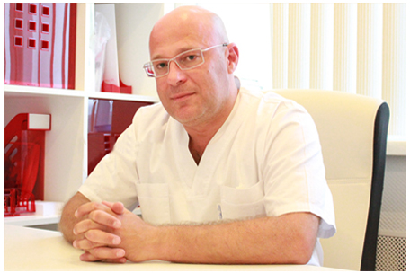

 {.width-50 .float-right}

Гварамия Алексей Алекович -- пластический хирург, врач высшей категории.

В 1991 г. окончил 2-й Московский медицинский институт имени Н.И.
Пирогова (ныне - Российский национальный исследовательский медицинский
университет имени Н.И. Пирогова) по специальности <<Лечебное дело>>.
Изначально начал заниматься исключительно пластической хирургией, а не
пришёл из других специальностей. Это его первичная специализация,
которой он начал заниматься в НПО <<Косметология>> (ныне -- Институт
пластической хирургии и косметологии ) с 1991 года под руководством
одного из основоположников пластической хирургии в нашей стране Ильи
Исааковича Фришберга.

С 1991-го по 1993 г. проходил подготовку в клинической ординатуре при
Научно-практическом объединении <<Косметология>> Минздрава России
(руководитель -- И.И. Фришберг). После окончания ординатуры проходил
стажировку в клинике пластической хирургии доктора Джона Барнетта
(Даллас, США) и работал в клинике Southwestern Medical Center , в
отделении трансплантации кожи с 1993-го по 1994 г.

Повышение квалификации: В 1999г. - при Международной Медицинской
корпорации (г.Москва) по специальности "Хирургия"

В 2000г. - при Медицинской академии последипломного образования
(г.Санкт-Петербург) по специальности -"Пластическая, реконструктивная и
эстетическая хирургия"

В 2002г. - при Российской медицинской академии последипломного
образования (г.Москва) по программе "Микрохирургия".

В 2006г.- при Российской медицинской академии последипломного
образования (г.Москва) по программе "Хирургия" В 2006г. прошел
профессиональную переподготовку по специальности "Хирургия"

В 2011г. - при Российской медицинской академии последипломного
образования (г.Москва) по программе "Хирургия".

В 2012г. - при Московском государственном медико-стоматологическом
университете им.А.И.Евдокимова

В 2013г.-профессиональная переподготовка по специальности "Пластическая
хирургия". Действительный член Общества Пластических, Эстетических и
Реконструктивных хирургов.

Провел более 2000 операций по комплексной реювенации (омоложению) лица.
