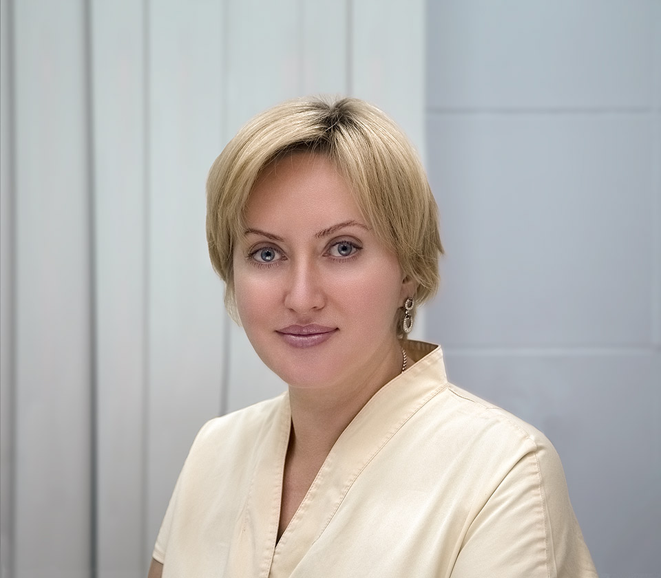

### Главный врач медицинского кабинета "Знак качества"

 {.width-50 .float-right}

1995 - 2001 -- РГМУ, факультет "Лечебное дело" (с отличием),
дополнительное образование --- "Врач-реабилитолог", дополнительная
специализация --- "Лечебный массаж".

1999 - 2001 --- Институт пластической хирургии и косметологии МЗ РФ,
специализация "Врачебная косметология" (с отличием) 500 ак. ч.

2001 - 2003 --- ФУВ МОНИКИ им. Владимирского, специализация
"Дерматовенерология" (с отличие, продлен до 2018 г.).

2001 - 2002 --- ДРК и Московский государственный институт сервиса,
специализация "Косметолог" (с отличием).

2004 -- РМАПО, удостоверение о повышении квалификации "Опухоли и другие
пролиферативные заболевания кожи".

2004 --- ФУВ РУДН, удостоверение о повышении квалификации "Трихология:
диагностика и лечение волос и кожи колосистой части головы".

2005 --- НО "Ассоциация российских озонотерапевтов", удостоверение о
повышении квалификации "Основы озонотерапии".

2007 --- ГОУВПО СПБГМА им. Мечникова, удостоверение о повышении
квалификации "Гомеопатическая мезотерапия в дерматокосметологии".

2005 --- АНО Учебно-методический центр "Валлекс-М", удостоверение о
повышении квалификации "Современные инъекционные методики в эстетической
медицине".

2008 --- ФУВ МОНИКИ им. Владимирского, удостоверение о повышении
квалификации "Актуальные вопросы дерматовенерологии".

2006 --- ФУВ РУДН, удостоверение о повышении квалификации
"Органопрепараты в клинической практике".

2011 --- ГНЦ лазерной медицины, специализированные курсы по лазерной
медицине 144 ак. ч.

2011 (продлён до 2021) --- ФУВ РУДН, специализация "Врач-косметолог" (с
отличием) 572 ак. ч.

2016 - 2018 --- Институт Preventage, специализация "Врач функциональной
и антивозрастной медицины"

Государственные сертификаты по дерматовенерологии, врачебной
косметологии, лазерной медицине, современным инъекционным и нитевым
методикам. Учеба и стажировка за рубежом. Сертификаты специалиста по
работе с лазерами и фотосистемами, всеми инъекционными препаратами (БТА,
гиалуроновыми кислотами, гидроксиапатитами, полимолочной кислотой).
Владение методами волюметрической коррекции, нитевыми технологиями,
технологией введения с помощью канюль.

[Показать сертификаты](./legun-alla-certificates.pdf)
