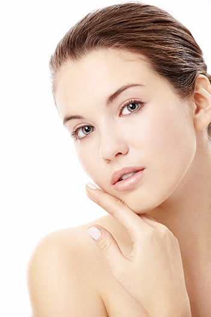

{.width-50 .float-right}

Примерно в возрасте 25-ти лет наша кожа начинает претерпевать изменения,
причем довольно неприятные: терять упругость, эластичность, а также
становиться более сухой. В этот период на помощь еще может прийти
косметика, однако с каждым годом её эффективность будет становиться все
менее заметной. Но есть и хорошая новость: справиться с этой проблемой
можно, причем не прибегая к хирургии. В этом нам поможет
биоревитализация.

Само слово <<биоревитализация>> (Москва знает о нем уже не первый год)
можно расшифровать как <<натуральное возвращение жизни>>. Значение этого
слова хорошо отражает его суть: посредством инъекций в организме
человека поступает гиалуроновая кислота. Наиболее эффективным препаратом
для достижения такого эффекта является IAL-System.

Данное средство представляет собой гель, в основе своей содержащий
натуральную немодифицированную гиалуроновая кислоту. Это совершенно
безопасное вещество, более того -- все мы являемся его носителями.
Именно гиалуроновая кислота отвечает за эластичность и гладкость кожи,
однако дело в том, что со временем её количество в нашем организме
начинает сокращаться. Именно эту потерю и стремится восполнить
IAL-system. Не лишним будет упомянуть, что гиалуроновая кислота в
составе этого препарата имеет исключительно естественное происхождение
-- его добывают из петушиных гребешков, очень щедрых на это вещество. И,
разумеется, данный препарат прошел самые суровые проверки на качество и
безопасность, что подтверждается регистрационными свидетельствами
Минздрава РФ.

С безопасностью разобрались. Однако насколько препарат эффективен? Дело
в том, что гиалуроновая кислота в IAL-System максимально <<чиста>>, т.е.
не подвержена практически никакой обработке. Это позволяет ей удерживать
максимальное количество молекул воды в коже, что естественным образом
влечет за собой омоложение кожи, устранение дряблости, сглаживание
морщин, улучшения тургора, стимуляцию микроциркуляцию и улучшение защиты
клеток. Кроме этого, отметим еще несколько <<технических>> преимуществ
IAL-System:
* отсутствие болезненных или неприятных ощущений при применении;
* отсутствие восстановительного периода;
* быстрый результат.

Именно благодаря всем этим качествам данное средство является абсолютным
лидером на рынке.

Сама биоревитализация (в Москве или любом другом городе -- процедура
практически не отличается) не заключает в себе ничего сложного или
неприятного. Перед началом процедуры проводится полный демакияж лица.
Далее инъекции препарата точечно вводятся в определенные участки кожи,
чтобы гиалуроновая кислота распределилась наиболее оптимально. Сама
процедура длится всего 50 минут. Однако организм -- вещь строго
индивидуальная, поэтому косметолог может назначить несколько сеансов с
различным интервалом между ними.

Необязательно прибегать к биоревитализации только тогда, когда кожа
начинает проявлять заметные признаки старения. Инъекции гиалуроновой
кислоты могут быть применены и для профилактики преждевременного
увядания кожи. В целом, если вы задумываетесь, стоит ли идти на такие
меры, можете ответить на следующие вопросы:
* Ваша кожа склонна к излишней сухости?
* Чрезмерному обезвоживанию?
* Снижению эластичности?
* Раннему старению из-за плохой экологии или вредных привычек?
* Имеют ли место пигментные пятна?
* Нуждается ли ваша кожа в восстановлении после операции?

Если вы дали ответ <<да>> на один или несколько из этих вопросов --
значит, биоревитализация может стать удачным вложением в решение этих
проблем.

Биоревитализация в Москве с применением IAL-System уже стала популярной
методикой. К сожалению, с этим препаратом происходит то же, что и со
всеми качественными вещами: среди них попадается довольно много
подделок. Кроме того, эффективность средства напрямую зависит от того,
насколько правильно были проведены инъекции, а это требует отточенного
мастерства и глубоких знаний. К счастью, мы можем реализовать оба эти
условия. В нашей клинике используется только настоящий IAL-System,
сделанный в Италии и подкрепленный всеми необходимыми сертификатами. А
применять этот качественный препарат будут дипломированные специалисты.
Это дает гарантию, что процедура не превратится в <<отчаянный
эксперимент>> с непредставимыми последствиями, а будет проведен
правильно и поэтапно, но при этом с учетом особенностей именно вашей
кожи. Такое сочетание проверенных методов вместе с личностным подходом и
дает нам право рекомендовать себя на роль ваших проводников в мир
красоты и молодости!
